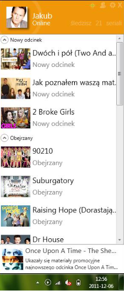
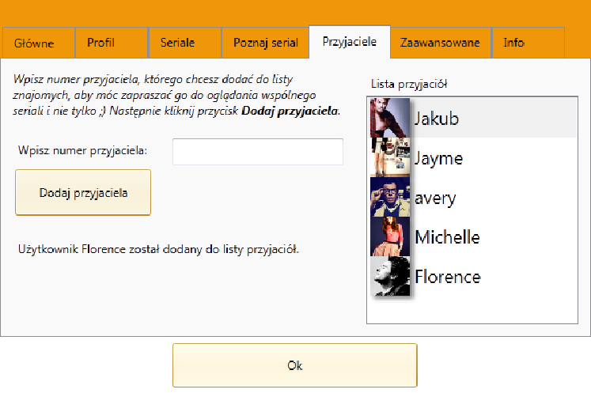

# Serialomaniak

## Description

Serialomaniak (C#, .NET, WPF) is an application designed to help you track your favorite shows
and keep note of the last episode you watched. The app provides comprehensive information about various shows and their episodes,
notifies you about new episodes, and suggests platforms where you can watch them.

Additionally, Serialomaniak aggregates news, updates and promotional materials from TV shows.
It offers personalized show recommendations based on your preferences.
Moreover, the app facilitates conversations with friends about specific episodes.

## Features

- TV Show and episode information display
- Airing new episode notifications
- Recommendations for watching
- Aggregation of news and promotional materials
- Personalized show recommendations
- Social interaction for discussing episodes with friends
- Import / export of backup
- Storing user data online
- Hide to trial icon

## Screenshots

Main window of the app (info about user profile, grouped list of tv shows, news and updates, trial icon)

Tv show details window

Recommendations system

Adding a friend

Talking live with a friend

## Roadmap

- Translation to english

- Update of UI

- Fixing old sources of data

- New server for storing user info

## Deployment and running

Due to the app's reliance on discontinued TV show websites,
its functionality may be compromised, resulting in unintended outcomes.
